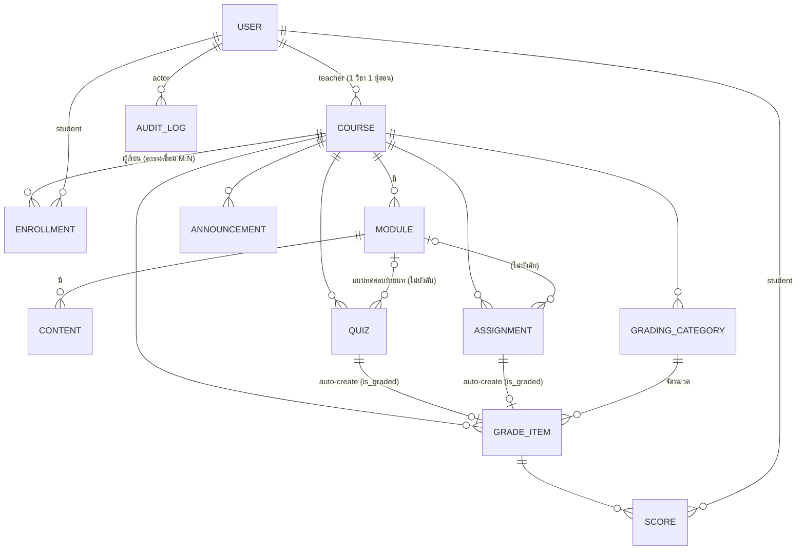
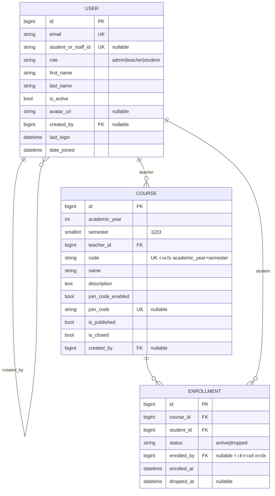
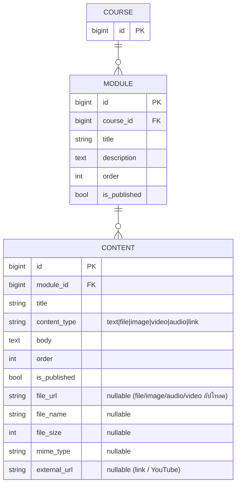
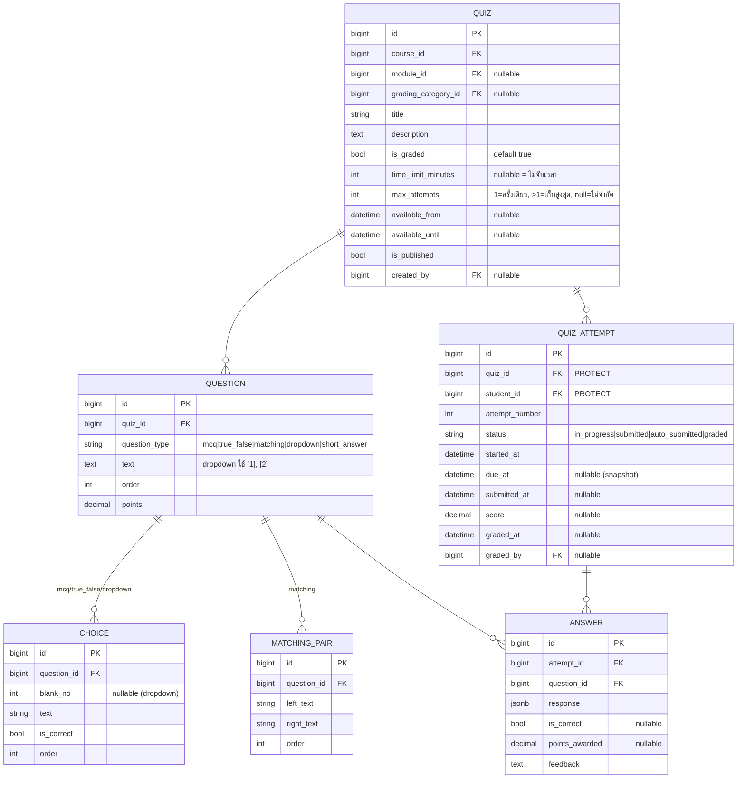
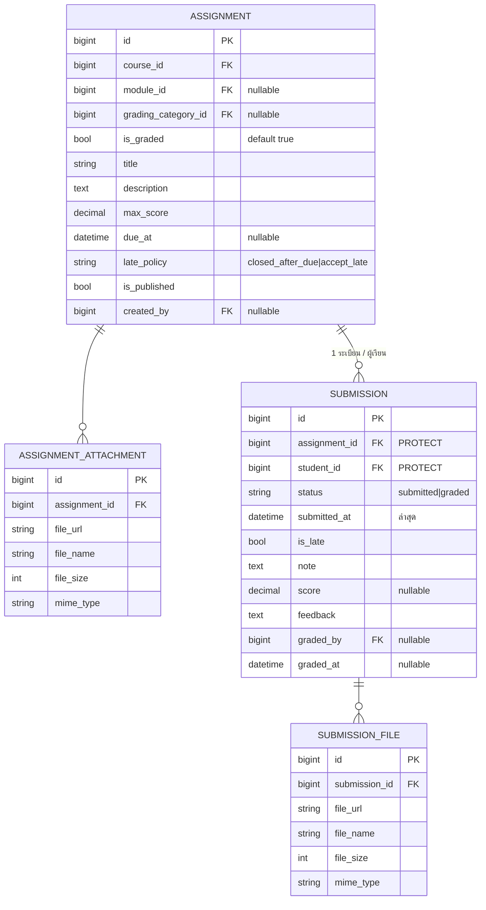
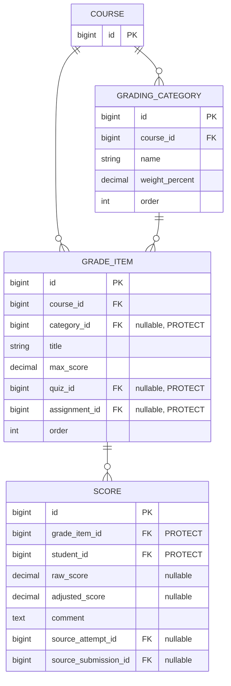
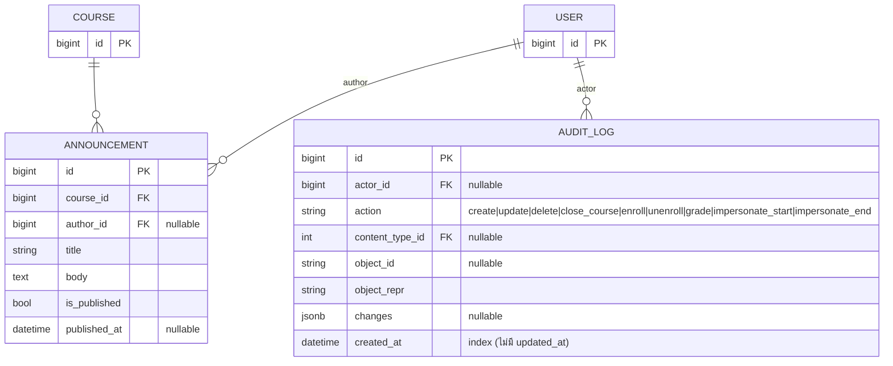

# ERD — LMS (Mermaid) · v2.2

> ประกอบกับ [`database.md`](./database.md) — แยก diagram ตามกลุ่มเดียวกับรายงานภาพที่ 4.1–4.6
> GitHub render Mermaid ในไฟล์ `.md` ได้โดยตรง

## ภาพรวมความสัมพันธ์หลัก (20 ตาราง)

> ชื่อ/หัวข้อทุกตารางเป็น **field เดียว** (ไม่แยก `_th` / `_en`)
> ไม่มี soft delete ; Quiz/Assignment ที่มีข้อมูลผู้เรียนลบไม่ได้ → ยกเลิกเผยแพร่ ; FK เข้าสู่คะแนน = `PROTECT` ; User ไม่ลบจริง (ระงับด้วย `is_active`)
> ตารางระบบที่ไม่นับ: `django_content_type` (อ้างโดย `AUDIT_LOG.content_type`), Simple JWT `token_blacklist`

## 1. กลุ่มบัญชีผู้ใช้และรายวิชา (+ ตารางเชื่อม Enrollment)

## 2. กลุ่มเนื้อหาบทเรียน

## 3. กลุ่มแบบทดสอบ

## 4. กลุ่มงานที่มอบหมาย

## 5. กลุ่มการให้คะแนน

> คะแนนรวมแบบถ่วงน้ำหนัก **คำนวณสดจาก `SCORE` ทุกครั้ง** — ไม่มีตารางเก็บคะแนนรวม

## 6. กลุ่มประกาศข่าวสารและบันทึกการใช้งาน

